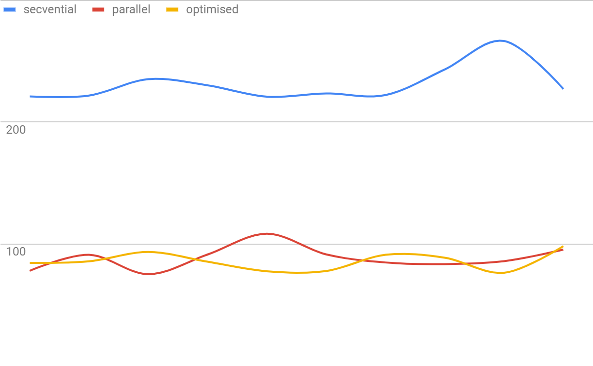

# **PPD: Laborator 1a - Java**

## **Analiza cerințelor**

### **Cerințe**

Adunarea a două “numere mari” (= numere reprezentate pe tablouri de numere întregi fără semn, ordonate crescător după cea mai nesemnificativă cifră din număr), folosind algoritmi ce lucrează **secvențial** sau **paralel**, în două variante:

1. **Varianta paralelă simplă** consideră rezolvarea problemei prin executia a 2 etape:
    1. prima etapă împarte cifrele în mod echilibrat pe fiecare thread, calculând câte un carry pentru fiecare thread
    2. a doua etapă actualizează rezultatul secvențial, adunând carry-urile corespunzătoare fiecărui thread, după execuția tuturor
2. **Varianta paralelă optimizată** îmbunătațește varianta anterioara, fie paralelizând calculul etapei a doua, fie considerând un alt algoritm paralel mai eficient

### **Constrângeri**

* Datele de intrare (cele două numere de adunat) se vor citi dintr-un fișier generat anterior rulării programului, cu numere aleatoare având între x și y cifre (parametri variabili)
* Numărul de thread-uri este un parametru variabil, dat la rulare
* Programul va afișa la final timpul de execuție corespunzător fiecărei implementări
* Încărcarea echilibrată a fiecărui thread
* Folosirea funcțiilor implementate la laboratorul precedent (lab0)

## **Proiectare**

### **Sumar**

În clasa **Start** începe execuția programului, ce execută o serie de funcții (statice, pentru eficiență,  împărțite intuitiv în clase pe pachete, în funcție de responsabilitate și utilitate).

Se generează două numere aleatoare în fișiere. Se citesc cele două numere și se apelează succesiv algoritmii secvențial, paralel și paralel optimizat. Se printează timpul execuției fiecăruia și se salveaza rezultatele intr-un fișier Excel (doar după ce se testează egalitatea rezultatelor).

### **Diagrama de clase**

### **Descrierea algoritmului**

1. Varianta secvențială
    1. se parcurg cei doi vectori de cifre de la început la final, adunându-se cifră cu cifră, plus un carry posibil rezultat din adunarea cifrelor anterioare
    2. la final, dacă rămâne un carry, se adaugă la finalul vectorului de sumă

2. Varianta paralelă simplă
    1. se alocă intervale de lungime egală fiecărui thread, urmând ca fiecare în parte să parcurga cei doi vectori de cifre pe intervalul dat, adunând cifră cu cifră la sumă, ținând cont de carry
    2. dacă la finalul adunării unui thread rămâne un carry, se salvează într-un dicționar împreună cu poziția următoare capătului intervalului (cea pe care trebuie adunat)
    3. se parcurge dicționarul de perechi poziție - carry, secvențial, adunându-se carry-urile la suma incompletă, pentru a da rezultatul final

3. Varianta paralelă optimizată
    1. identic variantei simple, se alocă intervale de lungime egală fiecărui thread, urmând ca fiecare în parte să parcurga cei doi vectori de cifre pe intervalul dat, adunând cifră cu cifră la sumă, ținând cont de carry
    2. se pune ultimul carry al thread-ului într-un vector comun, pe poziția cu id-ul thread-ului
    3. thread-ul verifică daca thread-ul anterior (ce a prelucrat intervalul anterior), a pus un carry in vectorul de carry-uri
    4. dacă valoarea găsită este 0, este posibil ca thread-ul anterior să nu fi terminat execuția, caz în care thread-ul curent va aștepta finalizarea celui anterior
    5. dacă valoarea găsită este 0 **și** thread-ul anterior a finalizat execuția, atunci oprim thread-ul curent ( nu mai are adunări de făcut)
    6. dacă valoarea găsită este 1, thread-ul curent reia intervalul prelucrat anterior și adaugă carry-ul la sumă, “propagându-l” spre dreapta
    7. dacă la finalul intervalului, carry-ul a rămas cu valoarea 1, se va adăuga această valoare pe poziția cu id-ul thread-ului curent din vectorul comun
    8. **observație:** primul thread (id=0) își va termina execuția după pasul **ii**, iar ultimul thread va adăuga carry-ul la finalul sumei, **nu **in vectorul comun, deoarece nu există un următor thread care să îi preia carry-ul (capăt de linie)

### **Optimizare**

* Folosirea unor tipuri de date optime(ca dimensiune, acces și siguranță):
    1. vectori de tip **byte[]** (dimensiunea minimă de stocare pentru cifre in Java)
    2. dicționar de tip **ConcurrentHashMap** (permite acces concurent pe thread-uri)
    3. tipuri primitive de date, oriunde se permite
* Pasarea datelor prin referință, nu copie (pentru eficiență, trivial)

## **Testare**

### **1 thread**

**Secvențial**  : 224ms
**Paralel**     : 210ms
**Optimizat**   : 210ms

### **2 thread-uri**

**Secvențial**  : 238ms
**Paralel**     : 137ms
**Optimizat**   : 127ms

### **4 thread-uri**

**Secvențial**  : 230ms
**Paralel**     : 105ms
**Optimizat**   : 97ms

### **8 thread-uri**

**Secvențial**  : 231ms
**Paralel**     : 89ms
**Optimizat**   : 85ms

### **Condiții de testare**

* Processor Intel Core i5-8250U CPU @ 1.60GHz, 1800 Mhz, 4 Cores, 8 Logical
* 8 GB RAM (4 rezervați pentru mașina virtuală)
* Performanța testată pe 2^26 (~ 67 milioane) cifre
* 10 rulări pentru fiecare caz (1/2/4/8 thread-uri)
