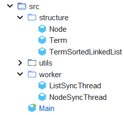
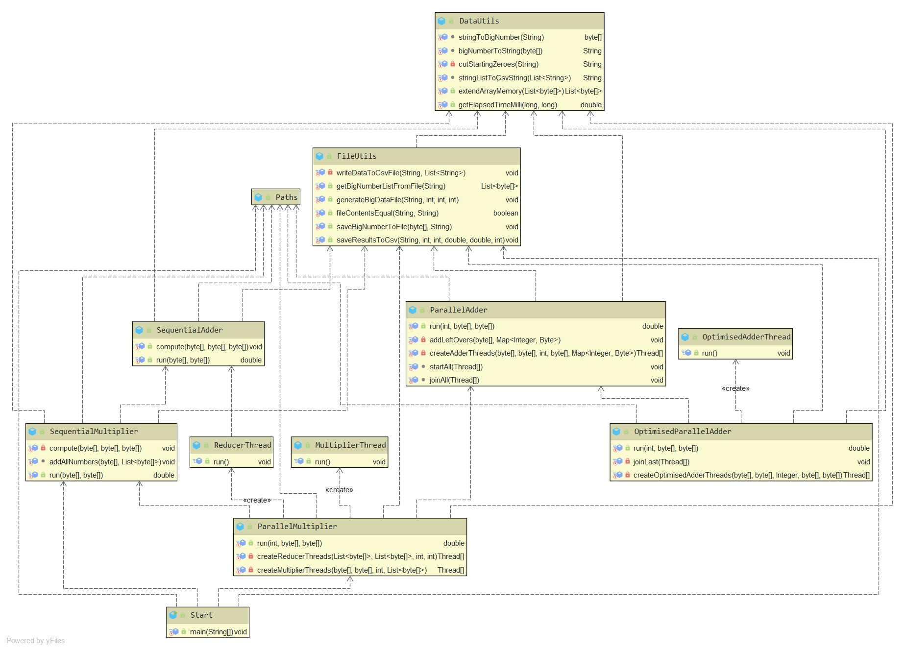
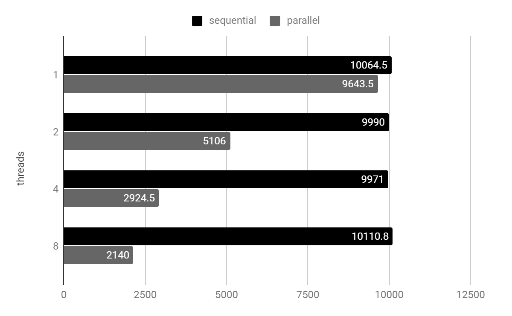

# **PPD: Laborator 3_a - Java**

## **Analiza cerințelor**

### **Cerințe**

Se considera n polinoame reprezentate prin lista de monoame (reprezentare: lista inlantuita).
Se cere implementarea multithreading (p threaduri) pentru operatia de adunare.

Metoda:

1. Se creeaza lista inlantuita - L corespunzatoare unui polinom nul.
2. Fiecare thread citeste date corespunzatoare unui polinom
    1. citeste cate un monom si il adauga in lista
3. Se repeta **2.** pana cand se aduna toate polinoamele.
4. Rezultatul obtinut in lista L se scrie intr-un fisier rezultat.

Varianta A) Sincronizare la nivel de lista
Varianta B) Sincronizare la nivel de nod din lista

### **Constrângeri**

* Polinoamele se citesc din fisiere
    1. cate un fisier pentru fiecare polinom
    2. un fisier contine informatii de tip (coeficient, exponent) pentru fiecare monom al unui polinom.

## **Proiectare**

### **Sumar**

Se generează fișiere cu polinoame în funcție de parametrii dați la intrare si se pun într-o coadă, apoi se creează și se rulează **P** thread-uri. Fiecare thread citește câte un fișier și adaugă câte un monom la o listă înlanțuită comună. Adăugarea la listă se face în două variante.

### **Diagrama de clase**

### **Descrierea algoritmului**

1. Varianta A - sincronizare la nivel de listă
    1. dacă există nodul rădăcină, se creează un nod nou cu monomul de adăugat, **ieșire**
    2. se compară monomul din rădăcină cu cel de adăugat
        1. dacă rădăcina conține un grad mai mic, monomul se adaugă în fața rădăcinii, într-un nou nod rădăcină, **ieșire**
        2. dacă rădăcina conține același grad, se adună coeficienții  (dacă suma este 0, se șterge nodul), **ieșire**
        3. altfel, se trece la pasul următor
    3. se țin referințe la un nod **precedent** (inițial rădăcina) și nodul **curent** (următorul după precedent)
    4. dacă nodul curent este **null**, se creează un nod nou cu monomul de adăugat ca nod următor al nodului precedent, ieșire
    5. se compară monomul din nodul curent cu cel de adăugat
        1. dacă nodul conține un grad mai mic, monomul se adaugă într-un nou nod, pus între cel precedent și cel curent, **ieșire**
        2. dacă nodul conține același grad, se adună coeficienții (dacă suma este 0, se șterge nodul), **ieșire**
    6. nodul **precedent** devine cel **curent**, cel **curent** devine următorul și se repetă pasul **1.4**

2. Varianta B - sincronizare la nivel de noduri
    1. se urmează aceiași pași ca la varianta A, dar se vor sincroniza următorii pași
        1. sincronizare pe nodul **rădăcină** la pașii **i - ii** (dacă rădăcina este **null**, se va face sincronizare pe tot obiectul)
        2. sincronizare pe nodul **precedent** la pașii **iii - vi**
        3. sincronizare pe nodul **curent** la pașii **iv - vi**

### **Optimizare**

* Pornirea decalată in varianta B, pentru a evita “aglomerarea” thread-urilor la adăugare pe blocarea nodului rădăcină
* Folosirea unei cozi pentru fișierele cu polinoame, pentru ca fiecare thread să lucreze încontinuu, deoarece dimensiunea fișierelor diferă (balanced loads)

## **Testare**

### **Condiții de testare**

* Processor Intel Core i5-8250U CPU @ 1.60GHz, 1800 Mhz, 4 Cores, 8 Logical
* 8 GB RAM (4GB alocați pentru JVM)
* Performanța testată pe următorii parametri
    1. număr de polinoame                           -  **100**
    2. număr maxim de monoame / polinom             -  **10000**
    3. grad maxim al unui monom                     -  **10000**
    4. domeniu al coeficientilor                    -  **[-10, 10]**
* 5 rulări pentru fiecare caz (2/4/8 thread-uri)
* unitatea pentru măsurarea timpului de execuție    -  **secunde**

