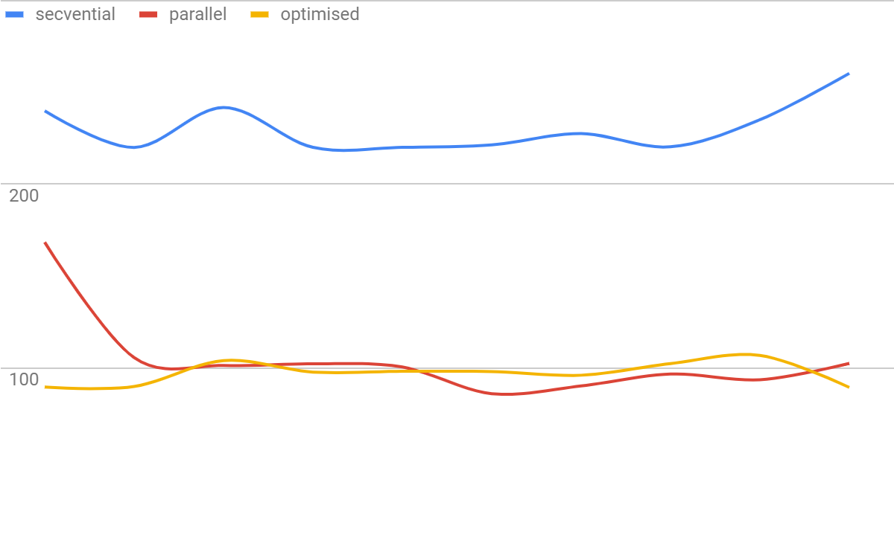

# **PPD: Laborator 3b - Java**

## **Analiza cerințelor**

### **Cerințe**

Se consideră n polinoame reprezentate prin listă de monoame (reprezentare: listă înlănțuită).
Se cere implementarea multithreading (p threaduri) pentru operatia de adunare.

Metoda:

1. Se creeaza lista inlantuita - L - corespunzatoare unui polinom nul
2. Primul thread citeste cate un monom si il adaugă într-o structura de date de tip coada
3. Celelalte threaduri preiau cate un monom din coada si il aduna la polinomul reprezentat in lista L
4. Se continua pana cand toate monoamele, din toate fisierele, sunt adunate la lista L
5. Rezultatul obtinut in lista L se scrie intr-un fisier rezultat.

Ce implicatii ar avea considerarea mai multor threaduri „cititoare”?

### **Constrângeri**

* Polinoamele se citesc din fisiere
    1. cate un fisier pentru fiecare polinom
    2. un fisier contine informatii de tip (coeficient, exponent) pentru fiecare monom al unui polinom

## **Proiectare**

### **Sumar**

Se generează fișiere cu polinoame în funcție de parametrii dați la intrare si se pun într-o coadă, apoi se creează și se rulează **P** thread-uri.

Se testează cu 1, 2, …, P-1 thread-uri care citesc din fișierele din coadă și pun monoamele în altă coadă, apoi un număr de P-1, P-2, …, 1 thread-uri (cele rămase) vor prelua din coada de monoame elementele și le vor adăuga in polinom, prin metoda implementată la laboratorul anterior. (ambele variante)

### **Diagrama de clase**

### **Descrierea algoritmului**

1. Crearea și rularea unui număr **R** de thread-uri ce citesc ( 1 ≤ R < **P**)
    1. fiecare thread primește referința unei cozi cu nume de fișiere
    2. un thread deschide câte un fișier și adaugă, linie cu linie, monoamele într-o altă coadă
    3. execuția unui thread se finalizează atunci când coada de fișiere este goală
2. Crearea și rularea unui număr **P-R** de thread-uri ce inserează
    1. fiecare thread primește referința cozii cu monoame, cea în care cele **R** thread-uri adaugă ceea ce citesc
    2. un thread ia câte un monom din coadă și inserează într-o listă înlănțuită
    3. execuția unui fișier se finalizează atunci când coada de monoame este goală **și** toate cele **R** thread-uri cititoare și-au finalizat execuția
3. La finalul execuției celor **P** thread-uri, se salvează polinomul rezultat într-un fișier și se afișează timpul total de execuție pe ecran

### **Observații**

* Pentru inserarea nodurilor în listă s-au folosit **ambele** variante din implementarea laboratorului anterior, pentru compararea rezultatelor
* Structurile de date folosite de tip **coadă** și **listă înlănțuită** au fost implementate manual pentru această soluție, parțial (doar funcțiile necesare în context)
* Condiția de thread safety a fost îndeplinită prin sincronizarea metodelor (plus varianta sincronizării nodurilor din lista înlănțuită)

## **Testare**

### **Condiții de testare**

* Processor Intel Core i5-8250U CPU @ 1.60GHz, 1800 Mhz, 4 Cores, 8 Logical
* 8 GB RAM (4GB alocați pentru JVM)
* Performanța testată pe următorii parametri
    1. număr de polinoame                           -  **100**
    2. număr maxim de monoame / polinom             -  **2500**
    3. grad maxim al unui monom                     -  **2500**
    4. domeniu al coeficientilor                    -  **[-10, 10]**
* 5 rulări pentru fiecare caz (2/4/8 thread-uri)
* unitatea pentru măsurarea timpului de execuție    -  **secunde**

